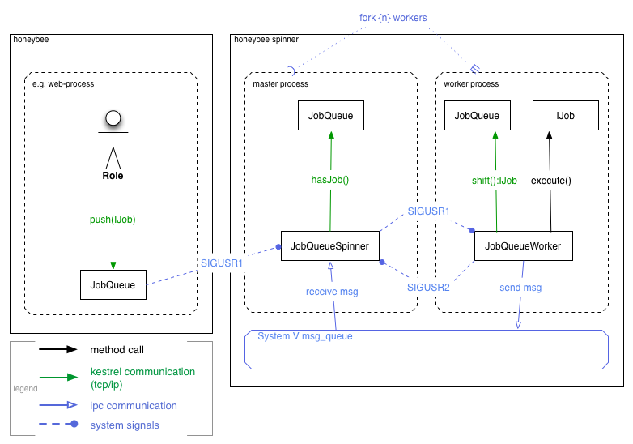

# JobQueue

## Table of contents

- [Introduction](#introduction)
- [Using Jobs](#using-jobs)
    - [Job-Bundle](#job-bundle)
- [Implementing Jobs](#implementing-jobs)
    - [Extending DocumentJob](#extending-documentjob)
    - [Extending BaseJob](#extending-basejob)
    - [Implementing IJob](#implementing-ijob)
- [Managing Worker Pools](#managing-worker-pools)
- [Monitoring](#monitoring)
- [Architecture](#architecture)
- [Pitfalls](#pitfalls)

## Introduction

Honeybee ships with a `JobQueue` component, 
that allows to asynchronously execute longer running tasks, 
such as for example video transcoding or large data transformations.  
The `JobQueue` uses the `Kestrel` message queue to get the critical queueing work done 
and adds a PHP interface for defining jobs and distributing them to a pool of long running workers.  
In order to get a specific task processed, you only need to implement a simple one-method interface 
and can then immediately start pushing jobs to your worker-pools.  
It is easy to spawn, kill, expand and shrink worker-pools, which may run on any machine that is reachable via tcp/ip. 

Read more about `Kestrel` here:
[robey.github.io/kestrel](http://robey.github.io/kestrel/ "Kestrel - Distributed Message Queue")  

## Using Jobs

@tbd

Example that shows how a `PublishJob` is created and added to the `JobQueue`. 

```php
use Honeybee\Core\Job\Bundle\PublishJob;
use Honeybee\Core\Job\Queue\KestrelQueue;

$queue = new KestrelQueue('sl1::default');
$job_parameters = array(
    'module_class' => get_class($document->getModule()),
    'document_identifier' => $document->getIdentifier()
);
$queue->push(new PublishJob($job_parameters));
```

### Job-Bundle

Honeybee has a number of ready to use default jobs with the `Honeybee\Core\Job\Bundle` namespace. 

* `PublishJob`
* `UpdateBackReferencesJob`

@tbd

## Implementing Jobs

To get a first job up and running, you need to either implement the 
[Honeybee\Core\Job\IJob](https://github.com/berlinonline/honeybee/blob/master/app/lib/Honeybee/Core/Job/IJob.php "Honeybee Job-Interface") 
interface or extend one of the existing job base-classes. 

- [Honeybee\Core\Job\DocumentJob](https://github.com/berlinonline/honeybee/blob/master/app/lib/Honeybee/Core/Job/DocumentJob.php "DocumentJob source") 
- [Honeybee\Core\Job\BaseJob](https://github.com/berlinonline/honeybee/blob/master/app/lib/Honeybee/Core/Job/BaseJob.php "BaseJob source") 

`DocumentJob` is useful when you are dealing with a task that relates/maps to a single document. 
In all other cases it is recommended to extend the `BaseJob` class rather than implementing `IJob` from scratch. 

`BaseJob` ... @tbd

### Extending DocumentJob

The `DocumentJob` base-class has everything setup to implement the `IJob` interface towards processing `Document` instances. 

```php
namespace Project\Job\Bundle;

use Honeybee\Core\Job\DocumentJob;

class ExampleJob extends DocumentJob
{
    protected function execute(array $parameters = array())
    {
        $document = $this->loadDocument();
        $module = $document->getModule();
        $document_service = $module->getService();
        // do something with or based on the document ...
        $document_service->save($document);
    }
}
```

### Extending BaseJob

The `BaseJob` .... @tbd

```php
namespace Project\Job\Bundle;

use Honeybee\Core\Job\BaseJob;

class ExampleJob extends BaseJob
{
    protected $foo;

    protected $bar;

    protected function execute(array $parameters = array())
    {
        error_log(
            "Executing " . __CLASS__ . " with foo: ". $this->foo . "and bar: " . $this->bar
        );
    }
}
```

### Implementing IJob

@tbd

```php
namespace Project\Job\Bundle;

use Honeybee\Core\Job\IJob;
use Honeybee\Core\Job\Queue\IQueueItem;

class ExampleJob implements IJob, IQueueItem
{
    protected $state = self::STATE_FRESH;

    public function run(array $parameters = array())
    {
        $state = null;
        try {
            // do the actual work
            $state = self::STATE_SUCCESS;
            // if things are not as expected
            //  $state = self::STATE_ERROR;
        }
        catch(\Exception $e) {
            $state = self::STATE_FATAL;
        }
        $this->setState($state);

        return $state;
    }

    public function getState()
    {
        return $this->state;
    }

    public function setState($state)
    {
        static $valid_states = array(
            self::STATE_FRESH,
            self::STATE_SUCCESS,
            self::STATE_ERROR,
            self::STATE_FATAL
        );
        if (!in_array($state, $valid_states)) {
            throw new Exception("Invalid state given.");
        }
        $this->state = $state;
    }
}
```

## Managing Worker Pools

@tbd

## Monitoring

Honeybee provides a simple realtime monitor for viewing information on job throughput and memory consumption. 
It is available at the `/common/queue/stats` url-path of your Honeybee instance.  
At the moment the monitor GUI periodically pulls the last {n} lines of a json logfile, 
that is continuously updated by the `SpinnerStatsWriter`. 
New data is then rendered to different charts to visualize execution counts 
and correlating memory consumption for each `Worker` and the `Spinner`.  
When things are ok, the memory usage should come to stay at a constant value pretty early.  
"Pretty early" means something like after the first 10 jobs executed.  
The intermediate memory usage should not be much higher than ~20Mb for each process. 

@todo insert screenshot of monitor gui

## Architecture

@tbd

Coarse grained view of the signal/execution topologie:



## Pitfalls

As jobs execute
@tbd
